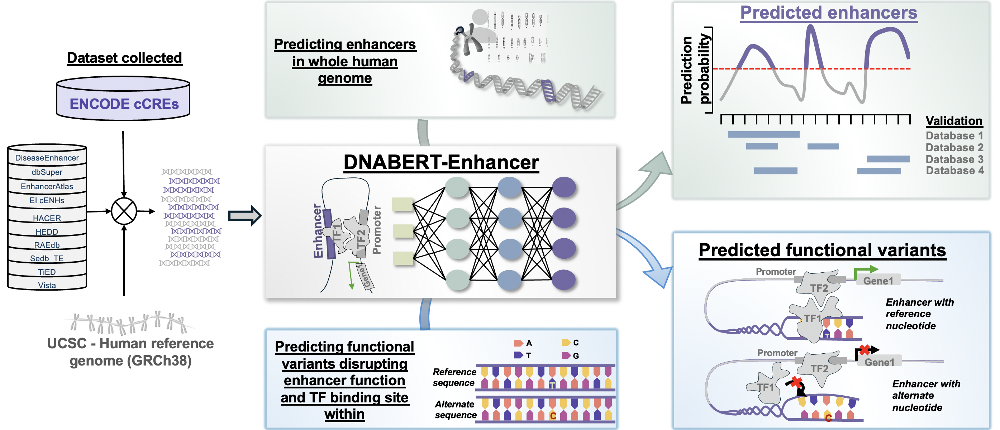
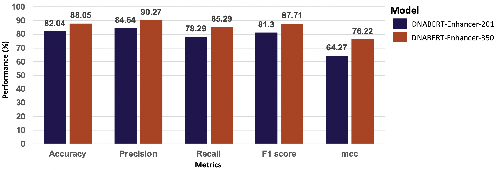

# Genomic Language Model for Predicting Enhancers and Their Allele-Specific Activity in the Human Genome

## Overview
<p align="justify"> DNABERT-Enhancer is a machine learning method based on the genome foundational large language model DNABERT. The fine-tuned model successfully identify enhancer regions in the human genome by focusing on the high-attention regions in the enhancer sequences. Moreover, DNABERT-Enhancer is applied to identify and predict candidate non-coding genomic variants in the enhancer regions which can cause a significant shift in enhancer function as well as disrupt the  TFBSs within. This repository hosts the DNABERT-Enhancer model, datasets, and related resources. </p>

## Table of Contents
- [Introduction](#introduction)
- [Abstract](#abstract)
- [Model and Usage](#model-and-usage)
  - [Requirements](#requirements)
  - [Download Fine-tuned Models](#download-fine-tuned-models)
  - [Fine-tuning the Model](#fine-tuning-the-model)
  - [Getting Predictions from the Model](#getting-predictions-from-the-model)
  - [Storing the Results in W&B](#storing-the-results-in-wb)
- [Citation](#citation)
- [Contact](#contact)

## Introduction
<p align="justify"> Enhancers coordinate the gene expression in a tissue-specific manner. Computational identification of these non-coding regulatory regions is challenging because of its intricate characteristics like varying lengths, ambiguous boundaries, functioning independent of their orientation and variable distances from associated promoters. Moreover, absence of well-defined genetic or epigenetic signatures that can accurately discriminate enhancers within genomic regions adds another layer of complexity. Enhancer malfunction due to genetic alteration mechanisms cause aberrant gene expression leading to genetic diseases like congenital disorders, cancers, and common complex diseases, collectively termed as enhanceropathies. Identifying disease-associated enhancers and recognizing GWAS-identified risk variants within them opens window for drug target discovery and enhancer-targeting therapies implying the clinical significance. Traditional machine learning methods often struggle to grasp the true context and the nuanced nature of enhancer DNA sequences, leading to uncertain real-world efficacy for enhancer prediction. </p>

## Abstract
<p align="justify">Predicting and deciphering the regulatory logic of enhancers is a challenging problem, due to the intricate sequence features and lack of consistent genetic or epigenetic signatures that can accurately discriminate enhancers from other genomic regions. Recent machine-learning based methods have spotlighted the importance of extracting nucleotide composition of enhancers, but models based solely on them fail to learn the sequence context and perform suboptimally.  Motivated by advances in genomic language models, we developed a novel enhancer prediction method, called DNABERT-Enhancer, by applying DNABERT pre-trained language model on the human genome. We trained two different models, one on 17,540 enhancers and the other on 36,927 enhancers curated from the ENCODE registry of candidate cis-Regulatory Elements (cCREs). The best fine-tuned model achieved performance of 88.05% accuracy with Matthews correlation coefficient (MCC) of 76% on independent set aside data. Further, we present the analysis of the predicted enhancers for all chromosomes of the human genome by comparing with the enhancer regions reported in publicly available databases. Finally, we applied DNABERT-Enhancer along with other DNABERT fine-tuned models to predict candidate SNPs with allele-specific enhancer and TF binding activity. The genome-wide enhancer annotations and candidate loss-of-function genetic variants predicted by DNABERT-Enhancer provide valuable resources for genome interpretation in functional and clinical genomics studies. </p>



## Model and Usage
DNABERT-Enhancer is built upon [DNABERT](https://github.com/jerryji1993/DNABERT), a large language model for the human genome, fine-tuned specifically for enhancer prediction.. This section describes how to use the code in this repository, including setting up the environment, fine-tuning a new model, and generating predictions with a pre-trained model.

  ### Requirements
  Before running the scripts, please install the necessary dependencies. We recommend creating a Python virtual environment. You can install all required packages using the `requirements.txt` file:
  ```bash
  pip install -r requirements.txt
  ```
  **Login to W&B:** The scripts use Weights & Biases for experiment tracking. You will need to log into your W&B account from your terminal.
  ```bash
  wandb login
  ```

### Download Fine-tuned Models
---
The final fine-tuned models used to generate the results in our paper are currently under review. **Upon formal acceptance of the paper, we will upload all model weights to a public repository (e.g., Hugging Face Hub or Zenodo) and provide the download links here.**

### Fine-tuning the Model
---
You can fine-tune the DNABERT model on your own dataset by running the provided training script. This script is configured to perform a hyperparameter search.
1.  **Configure Paths:** Open the `train.sh` script and modify the environment variables at the top to match your system's directory structure. You must set `MODEL_PATH`, `DATA_PATH`, `OUTPUT_PATH`, etc.
2.  **Execute the Script:** Run the script from your terminal.
**`train.sh`**
```bash
#!/bin/bash

# --- 1. CONFIGURE YOUR PATHS ---
export KMER=6
export CLASSES_NAME="Enhancer_NonEnhancer"
export DATA_NAME=24k_true_prediction_data
export DATA_SPLIT=80-20
export ARCHITECTURE="Initial_Screen_Enhancer_Models"
export MODEL_PATH="/path/to/your/pretrained_dnabert/6-new-12w-0" # UPDATE THIS
export DATA_PATH="/path/to/your/data/$DATA_NAME/$DATA_SPLIT"     # UPDATE THIS
export OUTPUT_PATH="/path/to/your/output/Finetuned_models"      # UPDATE THIS
export TB_PATH="/path/to/your/output/TB_Logfiles"               # UPDATE THIS
export SUMMARY_PATH="/path/to/your/output/Results"              # UPDATE THIS
export CUDA_VISIBLE_DEVICES=0,1,2

# --- 2. RUN TRAINING ---
# This script iterates through different learning rates, warmup percentages, and weight decays.
# Ensure you are in the directory containing run_finetune_WANDB.py before running.

learning_rates=("e-3" "e-4" "e-5" "e-6")
BATCH_SIZE=230

# Function to calculate logging and saving steps based on training data size
calculate_steps() {
    local train_file=$1
    local batch_size=$2
    local num_gpus=$(echo "$CUDA_VISIBLE_DEVICES" | tr -cd ',' | wc -c)
    num_gpus=$((num_gpus + 1))
    local num_lines=$(cat "$train_file" | wc -l)
    let "num_examples=num_lines-1" # Exclude header
    let "num_steps=num_examples/(batch_size*num_gpus)"
    let "logging_steps=num_steps*3/2"
    let "save_steps=num_steps*3"
    echo "$logging_steps $save_steps"
}

read logging_steps save_steps <<< $(calculate_steps "$DATA_PATH/train.tsv" $BATCH_SIZE)

for LR in "${learning_rates[@]}"; do
    echo "Processing for Learning Rate: $LR"
    for wp in 0.1 0.2; do
        for wd in 0.0001 0.001 0.005 0.01 0.02; do
            for lr in 1$LR 3$LR; do
                python scripts/run_finetune_WANDB.py \
                    --model_type dna \
                    --tokenizer_name=dna$KMER \
                    --model_name_or_path $MODEL_PATH \
                    --task_name dnaprom \
                    --classes_name $CLASSES_NAME \
                    --architecture $ARCHITECTURE \
                    --do_train \
                    --do_eval \
                    --data_dir $DATA_PATH \
                    --max_seq_length 200 \
                    --per_gpu_eval_batch_size=$BATCH_SIZE   \
                    --per_gpu_train_batch_size=$BATCH_SIZE  \
                    --learning_rate $lr \
                    --num_train_epochs 15 \
                    --output_dir $OUTPUT_PATH \
                    --tb_log_dir $TB_PATH \
                    --summary_dir $SUMMARY_PATH \
                    --evaluate_during_training \
                    --logging_steps $logging_steps \
                    --save_steps $save_steps \
                    --warmup_percent $wp \
                    --hidden_dropout_prob 0.1 \
                    --overwrite_output \
                    --weight_decay $wd \
                    --wandb_tags $CLASSES_NAME $DATA_NAME $LR $DATA_SPLIT \
                    --n_process 36
            done
        done
    done
done
```
### Getting Predictions from the Model
---
To get predictions on new data using a fine-tuned model, use the `predict.sh` script.
1.  **Configure Paths:**  Update the `MODEL_PATH` to point to your fine-tuned model directory and `DATA_PATH` to point to the data you want to analyze.
2.  **Execute the Script:** Run the script from your terminal.
**`predict.sh`**
```bash
#!/bin/bash

# --- 1. CONFIGURE YOUR PATHS ---
export KMER=6
export DATA_NAME=TFBS_prediction
export ARCHITECTURE=TFBS_H3K27ac
export CLASSES_NAME="Enhancer_NonEnhancer"
export MODEL_PATH="/path/to/your/finetuned_model_checkpoint"   # UPDATE THIS
export DATA_PATH="/path/to/your/prediction_data/$DATA_NAME"    # UPDATE THIS
export PREDICTION_PATH="/path/to/your/output/Predictions"      # UPDATE THIS
export SUMMARY_PATH="/path/to/your/output/Results"             # UPDATE THIS
export TB_PATH="/path/to/your/output/TB_Logfiles"              # UPDATE THIS
export CUDA_VISIBLE_DEVICES=1,2,3,4,5

# --- 2. RUN PREDICTION ---
# Ensure you are in the directory containing run_finetune_WANDB.py before running.

python scripts/run_finetune_WANDB.py \
    --model_type dna \
    --tokenizer_name=dna$KMER \
    --model_name_or_path $MODEL_PATH \
    --task_name dnaprom \
    --do_visualize \
    --visualize_data_dir $DATA_PATH \
    --classes_name $CLASSES_NAME \
    --architecture $ARCHITECTURE \
    --visualize_models $KMER \
    --data_dir $DATA_PATH \
    --max_seq_length 200 \
    --per_gpu_pred_batch_size=64 \
    --output_dir $MODEL_PATH \
    --predict_dir $PREDICTION_PATH \
    --tb_log_dir $TB_PATH \
    --wandb_tags $ARCHITECTURE $CLASSES_NAME $DATA_NAME \
    --summary_dir $SUMMARY_PATH \
    --n_process 30
```
### Storing the Results in W&B
---
Both the fine-tuning and prediction scripts are integrated with **Weights & Biases (W&B)** for experiment tracking. When you run the scripts, the following information is automatically logged to your W&B account:

-   **Hyperparameters:** Learning rate, batch size, weight decay, etc.
-   **Performance Metrics:** Training/evaluation loss, accuracy, F1-score, etc.
-   **System Metrics:** GPU/CPU utilization.
-   **Output Files:** Model checkpoints and prediction results can be saved as W&B artifacts.

This allows for easy comparison between runs and ensures full reproducibility of our results. All experiments from our paper are logged and can be viewed in our public W&B project (link to be provided upon publication).

### Model Highlights:
---


## Citation
---
If you use the DNABERT-Enhancer in your research, please cite our paper:

```bib

@article{ji2021dnabert,
    author = {Ji, Yanrong and Zhou, Zhihan and Liu, Han and Davuluri, Ramana V},
    title = "{DNABERT: pre-trained Bidirectional Encoder Representations from Transformers model for DNA-language in genome}",
    journal = {Bioinformatics},
    volume = {37},
    number = {15},
    pages = {2112-2120},
    year = {2021},
    month = {02},
    issn = {1367-4803},
    doi = {10.1093/bioinformatics/btab083},
    url = {https://doi.org/10.1093/bioinformatics/btab083},
    eprint = {https://academic.oup.com/bioinformatics/article-pdf/37/15/2112/50578892/btab083.pdf},
}


@misc{zhou2023dnabert2,
      title={DNABERT-2: Efficient Foundation Model and Benchmark For Multi-Species Genome}, 
      author={Zhihan Zhou and Yanrong Ji and Weijian Li and Pratik Dutta and Ramana Davuluri and Han Liu},
      year={2023},
      eprint={2306.15006},
      archivePrefix={arXiv},
      primaryClass={q-bio.GN}
}
